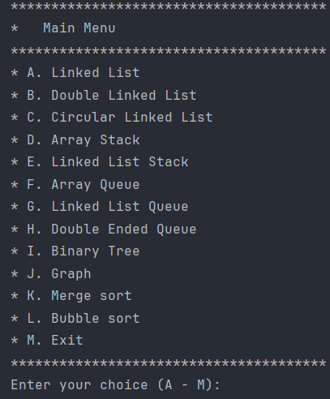

![Maintained][Maintained-shield]
![Forks][Forks-shield]
![Pull Request][PullRequest-shield]
![Pull Request Closed][PullRequestclosed-shield]
[![LinkedIn][linkedin-shield]][linkedin-url]

<!-- PROJECT LOGO -->
 

  

<h3 align="center">Data Structures</h3>

  

    Incremental project of the third module 
     
    <a href="https://github.com/NicoZela23/datastructure-nicolas"><strong>Explore the docs »</strong></a>
     
     
    <a href="https://github.com/NicoZela23/datastructure-nicolas">View Demo</a>
    ·
    <a href="https://github.com/NicoZela23/datastructure-nicolas/issues">Report Bug</a>
    ·
    <a href="https://github.com/NicoZela23/datastructure-nicolas/issues">Request Feature</a>
  

<!-- TABLE OF CONTENTS -->

  
Table of Contents

  <ol>
    <li>
      <a href="#about-the-project">About The Project</a>
      <ul>
        <li><a href="#development-environment">Development Environment</a></li>
      </ul>
    </li>
    <li>
      <a href="#getting-started">Getting Started</a>
    </li>
    <li><a href="#usage">Usage</a></li>
      <ul>
        <li><a href="#main-menu">Main Menu</a></li>
        <li><a href="#double-linked-list">Double Linked List</a></li>
        <li><a href="#circular-linked-list">Circular Linked List</a></li>
        <li><a href="#array-stack-and-linked-list-stack">Array Stack and Linked List Stack</a></li>
        <li><a href="#array-queue">Array Queue</a></li>
        <li><a href="#linked-list-queue">Linked List Queue</a></li>
        <li><a href="#double-ended-queue">Double Ended Queue</a></li>
        <li><a href="#binary-tree">Binary Tree</a></li>
        <li><a href="#graph">Graph</a></li>
        <li><a href="#merge-sort">Merge Sort</a></li>
        <li><a href="#bubble-sort">Bubble Sort</a></li>
        <li><a href="#exit">Exit</a></li>
      </ul>
  </ol>

<!-- ABOUT THE PROJECT -->
## About The Project

Welcome to the incremental project for the Data Structures class instructed by **_Mauricio Flores_**. This readme document serves as a dynamic guide that will undergo continuous updates throughout the module. As we progress through each subject, new features and sections will be added to enhance your understanding of data structures.

Table of Contents:
* Basic Data Structures
* Stacks and Queues
* Trees and Graphs
* Sorting Algorithms

While it's possible that not everything will be covered, the project will be updated with each new subject learned.

Use the `Run.main` button to see it by yourself.

### Development Environment
* [![Java][Java]][Java-url]
* [![IntelliJ IDEA][IntelliJ]][IntelliJ-url]
* [![Git][Git]][Git-url]
* [![Powershell][Powershell]][Powershell-url]
* [![Github][Github]][Github-url]

<!-- GETTING STARTED -->
## Getting Started

To run this project, ensure you have Java 21 installed along with any Integrated Development Environment (IDE). Simply execute a local build, and everything will be up and running smoothly.

Clone this project and test it by yourself! 

<!-- USAGE EXAMPLES -->
## Usage

The project showcased here was exclusively developed in Java, leveraging a console-based interface that interacts with every aspect of the application. Following a traditional approach, users navigate through the program's functionalities by inputting numerical selections or characters as dictated by the console menu.

**Having as options this way of choice using characters in the main menu**:
> Enter your choice (A - M):

**Or this in every other data structure menu depending on the amount of options available**
> Enter your choice (1-9):

Each option provided to access and experiment with the specific methods within each menu implementation is inherently self-explanatory. This not only offers guidance on usage but also provides insight into the underlying implementation details.
 

### Main Menu
The main menu serves as a central hub, facilitating access to each specific data structure menu simply by entering the corresponding character into the console. 
### Linked List
* `Add First` Adds a new node containing the specified data to the beginning of the linked list. The data to be added to the beginning of the linked list will be inserted by keyboard accepting integer values

* `Add Last` Adds a new node containing the specified data to the end of the linked list. The data to be added to the end of the linked list will be inserted by keyboard accepting integer values.

* `First Element` Returns the first node data of the linked list, or null if the list is empty

* `Last Element` Returns the last node data of the linked list, or null if the list is empty

* `List is Empty` Checks whether the linked list is empty or not. Returns true if the linked list is empty, false otherwise

* `List Size` Returns the number of elements currently stored in the linked list.

* `Remove First` Removes the first node from the linked list. If the linked list is empty, this method does nothing.

* `Print` Prints all elements in the linked list. The order of printing is from the first node to the last node. 

* `Exit` Returns to the Main menu

(<a href="#readme-top">back to top</a>)

### Double Linked List
* `Add First` Adds a new node containing the specified data to the beginning of the doubly linked list. The data to be added to the beginning of the doubly linked list will be inserted by keyboard accepting integer values

* `Add Last` Adds a new node containing the specified data to the end of the doubly linked list. The data to be added to the end of the doubly linked list will be inserted by keyboard accepting integer values.

* `First Element` Returns the first node data of the doubly linked list, or null if the list is empty

* `Last Element` Returns the last node data of the doubly linked list, or null if the list is empty

* `List is Empty` Checks whether the doubly linked list is empty or not. Returns true if the doubly linked list is empty, false otherwise

* `List Size` Returns the number of elements currently stored in the doubly linked list.

* `Remove First` Removes the first node from the doubly linked list. If the doubly linked list is empty, this method does nothing.

  
* `Remove Last` Removes the last node from the doubly linked list. If the doubly linked list is empty, this method does nothing.

* `Print` Prints all elements in the doubly linked list. The order of printing is from the first node to the last node.

* `Exit` Returns to the Main menu

(<a href="#readme-top">back to top</a>)

### Circular Linked List
* `Add First` Adds a new node containing the specified data to the beginning of the circular linked list. The data to be added to the beginning of the circular linked list will be inserted by keyboard accepting integer values

* `Add Last` Adds a new node containing the specified data to the end of the circular linked list. The data to be added to the end of the circular linked list will be inserted by keyboard accepting integer values.

* `First Element` Returns the first node data of the circular linked list, or null if the list is empty

* `Last Element` Returns the last node data of the circular linked list, or null if the list is empty

* `List is Empty` Checks whether the circular linked list is empty or not. Returns true if the linked list is empty, false otherwise

* `List Size` Returns the number of elements currently stored in the circular linked list.

* `Remove First` Removes the first node from the circular linked list. If the circular linked list is empty, this method does nothing.

* `Print` Prints all elements in the circular linked list. The order of printing is from the first node to the last node.

* `Exit` Returns to the Main menu

(<a href="#readme-top">back to top</a>)

### Array Stack and Linked List Stack
When accessing the array stack, you must first choose whether to initiate it with a preset capacity or utilize the default capacity, which is set to 1000.

being `1` the option to set capacity and `2` to use default capacity

When accessing the linked list, the capacity grows dynamically, eliminating any concerns about predefined limits. In terms of functionality, both options provide the same features; the only distinction lies in their implementations, with one utilizing arrays and the other employing linked lists.

* `Push Element` Adds a new node containing the specified data to the beginning of the circular linked list. The data to be added to the beginning of the circular linked list will be inserted by keyboard accepting integer values

* `Pop Element` Adds a new node containing the specified data to the end of the circular linked list. The data to be added to the end of the circular linked list will be inserted by keyboard accepting integer values.

* `Top Element` Returns the first node data of the circular linked list, or null if the list is empty

* `Stack is Empty` Returns the last node data of the circular linked list, or null if the list is empty

* `Stack Size` Checks whether the circular linked list is empty or not. Returns true if the linked list is empty, false otherwise

* `Print` Returns the number of elements currently stored in the circular linked list.

* `Exit` Returns to the Main menu

(<a href="#readme-top">back to top</a>)

### Array Queue
### Linked List Queue
### Double Ended Queue
### Binary Tree
### Graph
### Merge Sort
### Bubble Sort
### Exit

`Run.main`

[linkedin-shield]: https://img.shields.io/badge/-LinkedIn-black.svg?style=for-the-badge&logo=linkedin&colorB=555
[linkedin-url]: https://www.linkedin.com/in/nicozela/
[Maintained-shield]: https://img.shields.io/badge/Maintained%3F-yes-green.svg
[Forks-shield]: https://img.shields.io/github/forks/NicoZela23/datastructure-nicolas.svg
[PullRequest-shield]: https://img.shields.io/github/issues-pr/NicoZela23/datastructure-nicolas.svg
[PullRequestclosed-shield]: 	https://img.shields.io/github/issues-pr-closed/NicoZela23/datastructure-nicolas.svg
[Java]: https://img.shields.io/badge/Java-ED8B00?style=for-the-badge&logo=openjdk&logoColor=white
[Java-url]: https://www.java.com/es/
[IntelliJ]: https://img.shields.io/badge/Intellij%20Idea-000?logo=intellij-idea&style=for-the-badge
[IntelliJ-url]: https://www.jetbrains.com/idea/
[Git]: https://img.shields.io/badge/GIT-E44C30?style=for-the-badge&logo=git&logoColor=white
[Git-url]: https://git-scm.com/
[Powershell]: https://img.shields.io/badge/powershell-5391FE?style=for-the-badge&logo=powershell&logoColor=white
[Powershell-url]: https://www.microsoft.com/store/productId/9MZ1SNWT0N5D?ocid=pdpshare
[Github]: https://img.shields.io/badge/GitHub-100000?style=for-the-badge&logo=github&logoColor=white
[Github-url]: https://github.com/

