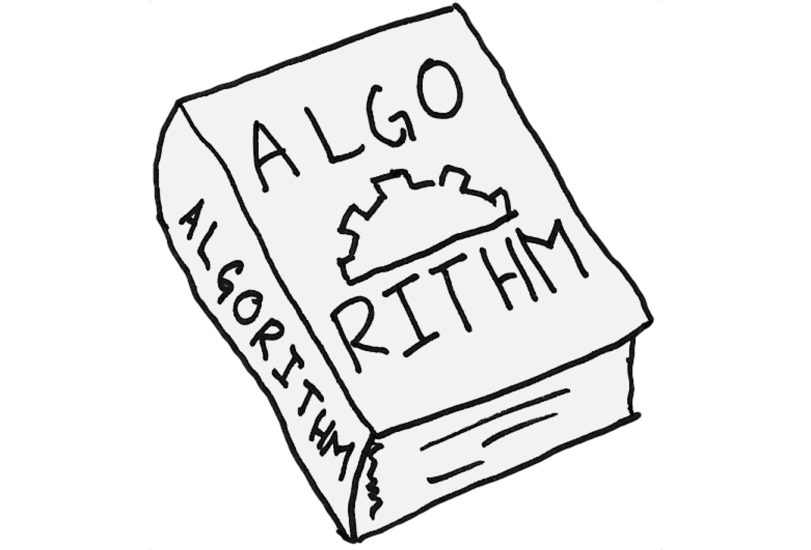

![Maintained][Maintained-shield]
![Forks][Forks-shield]
![Pull Request][PullRequest-shield]
![Pull Request Closed][PullRequestclosed-shield]
[![LinkedIn][linkedin-shield]][linkedin-url]

<!-- PROJECT LOGO -->
 

  

<h3 align="center">Data Structures</h3>

  

    Incremental project of the third module 
     
    <a href="https://github.com/NicoZela23/datastructure-nicolas"><strong>Explore the docs »</strong></a>
     
     
    <a href="https://github.com/NicoZela23/datastructure-nicolas">View Demo</a>
    ·
    <a href="https://github.com/NicoZela23/datastructure-nicolas/issues">Report Bug</a>
    ·
    <a href="https://github.com/NicoZela23/datastructure-nicolas/issues">Request Feature</a>
  

<!-- TABLE OF CONTENTS -->

  
Table of Contents

  <ol>
    <li>
      <a href="#about-the-project">About The Project</a>
      <ul>
        <li><a href="#development-environment">Development Environment</a></li>
      </ul>
    </li>
    <li>
      <a href="#getting-started">Getting Started</a>
    </li>
    <li><a href="#usage">Usage</a></li>
  </ol>

<!-- ABOUT THE PROJECT -->
## About The Project

[![Product Name Screen Shot][product-screenshot]](https://example.com)

Welcome to the incremental project for the Data Structures class instructed by **_Mauricio Flores_**. This readme document serves as a dynamic guide that will undergo continuous updates throughout the module. As we progress through each subject, new features and sections will be added to enhance your understanding of data structures.

Table of Contents:
* Basic Data Structures
* Stacks and Queues
* Trees and Graphs
* Sorting Algorithms

While it's possible that not everything will be covered, the project will be updated with each new subject learned.

Use the `Run.main` button to see it by yourself.

(<a href="#readme-top">back to top</a>)

### Development Environment

This section should list any major frameworks/libraries used to bootstrap your project. Leave any add-ons/plugins for the acknowledgements section. Here are a few examples.
* [![Java][Java]][Java-url]
* [![IntelliJ IDEA][IntelliJ]][IntelliJ-url]
* [![Git][Git]][Git-url]
* [![Powershell][Powershell]][Powershell-url]
* [![Github][Github]][Github-url]

(<a href="#readme-top">back to top</a>)

<!-- GETTING STARTED -->
## Getting Started

To run this project, ensure you have Java 21 installed along with any Integrated Development Environment (IDE). Simply execute a local build, and everything will be up and running smoothly.

<!-- USAGE EXAMPLES -->
## Usage

Not implemented yet :P

[linkedin-shield]: https://img.shields.io/badge/-LinkedIn-black.svg?style=for-the-badge&logo=linkedin&colorB=555
[linkedin-url]: https://www.linkedin.com/in/nicozela/
[Maintained-shield]: https://img.shields.io/badge/Maintained%3F-yes-green.svg
[Forks-shield]: https://img.shields.io/github/forks/NicoZela23/datastructure-nicolas.svg
[PullRequest-shield]: https://img.shields.io/github/issues-pr/NicoZela23/datastructure-nicolas.svg
[PullRequestclosed-shield]: 	https://img.shields.io/github/issues-pr-closed/NicoZela23/datastructure-nicolas.svg
[product-screenshot]: images/screenshot.png
[Java]: https://img.shields.io/badge/Java-ED8B00?style=for-the-badge&logo=openjdk&logoColor=white
[Java-url]: https://www.java.com/es/
[IntelliJ]: https://img.shields.io/badge/Intellij%20Idea-000?logo=intellij-idea&style=for-the-badge
[IntelliJ-url]: https://www.jetbrains.com/idea/
[Git]: https://img.shields.io/badge/GIT-E44C30?style=for-the-badge&logo=git&logoColor=white
[Git-url]: https://git-scm.com/
[Powershell]: https://img.shields.io/badge/powershell-5391FE?style=for-the-badge&logo=powershell&logoColor=white
[Powershell-url]: https://www.microsoft.com/store/productId/9MZ1SNWT0N5D?ocid=pdpshare
[Github]: https://img.shields.io/badge/GitHub-100000?style=for-the-badge&logo=github&logoColor=white
[Github-url]: https://github.com/

